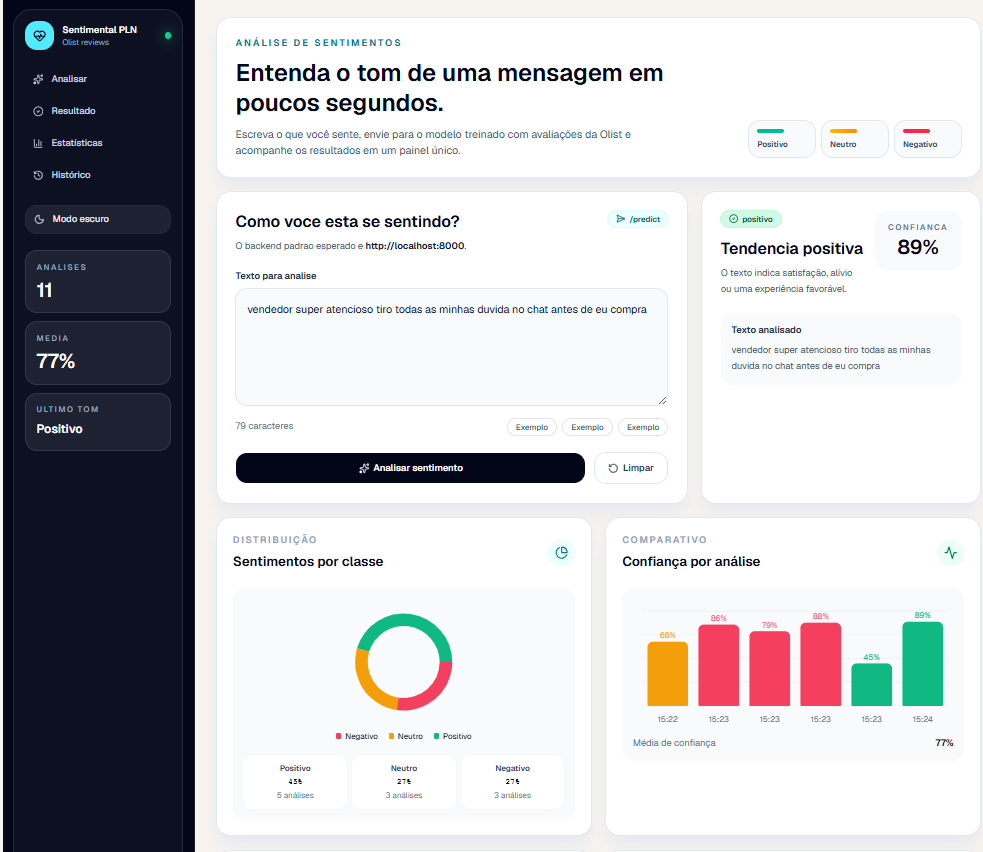
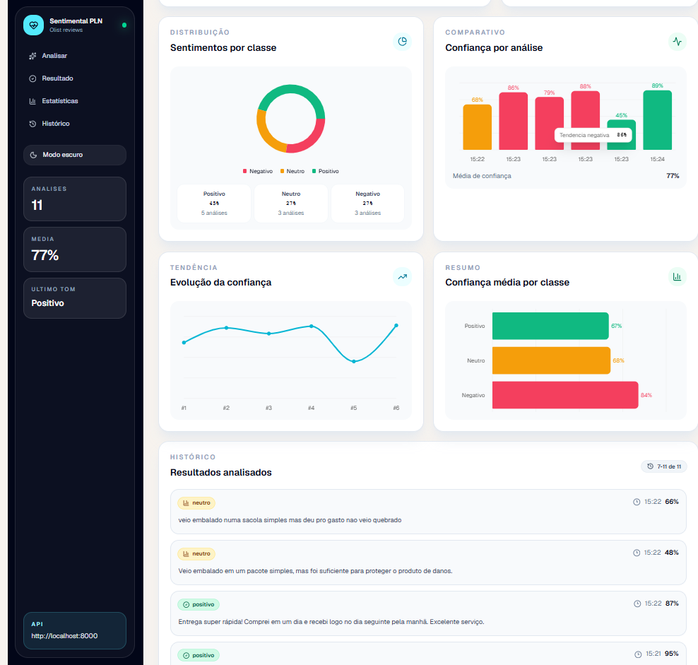

# 💙 Sentimental — Plataforma Inteligente de Análise de Sentimentos

Uma aplicação moderna desenvolvida com **Next.js**, **TypeScript** e **Recharts** para análise, monitoramento e visualização de sentimentos em textos.

O sistema permite que usuários submetam textos para processamento e obtenham insights emocionais através de dashboards interativos, métricas estatísticas e histórico de análises.

---

## 📌 Visão Geral

O **Sentimental** foi criado para auxiliar na identificação e interpretação de emoções expressas em conteúdos textuais, possibilitando a construção de soluções voltadas para:

* Atendimento ao cliente
* Monitoramento de redes sociais
* Pesquisa de satisfação
* Experiência do usuário (UX)
* Análise de feedbacks
* Estudos acadêmicos relacionados à Inteligência Artificial e Processamento de Linguagem Natural (NLP)

A plataforma foi projetada para ser facilmente integrada a APIs externas ou modelos próprios de Machine Learning.

---

# 🚀 Funcionalidades

## 📝 Análise de Sentimentos

* Inserção de textos para análise.
* Classificação automática do sentimento.
* Exibição de resultados em tempo real.
* Interface intuitiva e responsiva.

### Categorias suportadas

* 😀 Positivo
* 😐 Neutro
* 😞 Negativo

---

## 📊 Dashboard Analítico

Painel visual com métricas detalhadas:

* Quantidade total de análises realizadas.
* Distribuição de sentimentos.
* Tendências e comportamento emocional.
* Estatísticas agregadas.

---

## 📈 Visualização Gráfica

A aplicação utiliza a biblioteca **Recharts** para apresentar informações através de:

* Gráficos de barras
* Gráficos de pizza
* Indicadores estatísticos
* Comparativos temporais

---

## 📚 Histórico de Análises

Permite consultar análises realizadas anteriormente:

* Texto analisado
* Resultado obtido
* Data da análise
* Métricas associadas

---

## 🎨 Interface Moderna

Construída utilizando:

* Tailwind CSS
* Shadcn/UI
* Radix UI
* Lucide React

Benefícios:

* Responsividade
* Acessibilidade
* Componentização
* Design consistente

---

# 🏗️ Arquitetura do Projeto

```text
src/
│
├── app/
│   ├── dashboard/
│   ├── analysis/
│   ├── history/
│   └── layout.tsx
│
├── components/
│   ├── ui/
│   ├── charts/
│   ├── cards/
│   └── forms/
│
├── features/
│   └── sentiment/
│       ├── components/
│       ├── services/
│       ├── hooks/
│       └── types/
│
├── lib/
│
└── utils/
```

---

# 🛠️ Tecnologias Utilizadas

## Frontend

* Next.js 15+
* React 19+
* TypeScript

## Estilização

* Tailwind CSS
* PostCSS

## Componentes

* Shadcn/UI
* Radix UI

## Visualização de Dados

* Recharts

## Ícones

* Lucide React

---

# ⚙️ Instalação

## Pré-requisitos

* Node.js 18+
* npm, yarn ou pnpm

---

## Clonar o repositório

```bash
git clone https://github.com/seu-usuario/front-sentimental.git
```

```bash
cd front-sentimental
```

---

## Instalar dependências

```bash
npm install
```

---

## Executar em ambiente de desenvolvimento

```bash
npm run dev
```

A aplicação estará disponível em:

```text
http://localhost:3000
```

---

# 📦 Scripts Disponíveis

| Comando       | Descrição                          |
| ------------- | ---------------------------------- |
| npm run dev   | Executa em desenvolvimento         |
| npm run build | Gera build de produção             |
| npm run start | Executa build gerada               |
| npm run lint  | Executa análise estática de código |

---

# 🔌 Integração com APIs de IA

O projeto foi desenvolvido para permitir integração com diferentes mecanismos de análise de sentimentos:

* OpenAI
* Hugging Face
* Google Gemini
* Azure AI Language
* Modelos próprios em Python
* APIs REST personalizadas

Exemplo de variável de ambiente:

```env
NEXT_PUBLIC_API_URL=http://localhost:8080
```

Arquivo:

```text
.env.local
```

---

# 🔒 Boas Práticas Implementadas

* TypeScript para tipagem forte.
* Componentização reutilizável.
* Separação por features.
* Responsividade mobile-first.
* Estrutura escalável.
* Código preparado para integração contínua.

---

# 📋 Roadmap

## Próximas funcionalidades

* [ ] Autenticação de usuários
* [ ] Exportação de relatórios em PDF
* [ ] Comparação entre análises
* [ ] Histórico persistente em banco de dados
* [ ] IA generativa para explicação dos resultados
* [ ] Análise em lote de documentos
* [ ] Integração com redes sociais
* [ ] Dashboard administrativo

---

# 🧪 Qualidade de Software

Melhorias planejadas:

* GitHub Actions
* Testes unitários
* Testes de integração
* SonarQube
* Cobertura de testes

---

# 📷 Capturas de Tela

Adicionar imagens demonstrando:

* Tela inicial
* Dashboard
* Resultado da análise
* Histórico

Galeria de telas (exemplos):

<p align="center">
	
	
</p>

---

# 🤝 Contribuindo

1. Faça um Fork do projeto.
2. Crie uma branch:

```bash
git checkout -b feature/minha-feature
```

3. Faça commit das alterações:

```bash
git commit -m "feat: nova funcionalidade"
```

4. Faça push:

```bash
git push origin feature/minha-feature
```

5. Abra um Pull Request.

---

# 👨‍💻 Equipe

O projeto **Sentimental** foi desenvolvido de forma colaborativa por uma equipe multidisciplinar com foco em Inteligência Artificial, Processamento de Linguagem Natural (NLP), Desenvolvimento Web e Visualização de Dados.

## Integrantes

* Allan Marques
* Emerson Costa
* Felipe Pimentel
* Gabriel Martins
* Heloisa Costa
* Ricardo Tompson
* Walison Brandão

## Objetivo da Equipe

Desenvolver uma plataforma inteligente capaz de analisar sentimentos expressos em textos, transformando dados não estruturados em informações úteis para apoio à tomada de decisão, monitoramento de feedbacks e estudos relacionados à Inteligência Artificial.

A equipe atua desde a concepção da solução até a implementação do frontend, backend, integração com modelos de IA e visualização dos resultados por meio de dashboards interativos.

---

# 📄 Licença

Este projeto ainda não possui licença definida.

Caso deseje disponibilizá-lo publicamente, recomenda-se utilizar uma das seguintes:

* MIT License
* Apache 2.0
* GPL v3

---

⭐ Se este projeto foi útil para você, considere deixar uma estrela no repositório.
